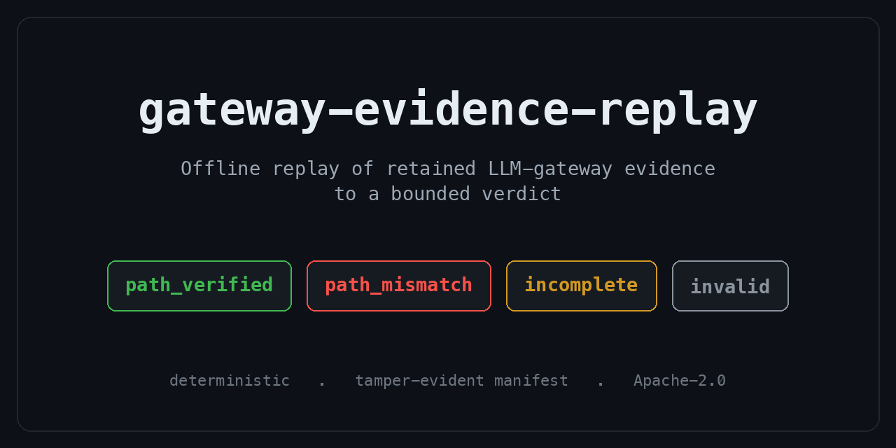

<p align="center">
  
</p>

# gateway-evidence-replay

A small offline tool that replays retained gateway-path evidence to a bounded verdict.

An LLM gateway decides the route, the fallback, the endpoint, the policy, and the stream, and it writes down what it
did. This tool takes that retained record and recomputes, off the gateway runtime, whether the bytes are enough to
back the path claim. It returns one of four verdicts and nothing else:

- `path_verified` - the retained evidence is complete and consistent with the claimed path.
- `path_mismatch` - the evidence contradicts the claimed path (route substitution, disallowed fallback, endpoint or
  policy mismatch, stream-commitment mismatch).
- `incomplete` - the evidence is not enough to confirm or refute (unverified, stale, missing stream evidence, or
  partial coverage with no contradiction).
- `invalid` - the input is malformed or its provenance is unknown.

It does not run a gateway, call a provider, verify a TEE root, or judge model output. Signature and
runtime-measurement results are treated as input facts inside the evidence, not recomputed here. The one thing it
checks is whether the retained bytes support the narrow gateway-path claim, and it returns `incomplete` rather than
guessing when they do not.

## Quickstart

Requires a recent stable Rust toolchain.

```bash
cargo build --release

# Verify one clean bundle
cargo run --release -- verify fixtures/gateway-path-v0/clean-route.json --json

# Replay the pinned four-bundle demo pack
cargo run --release -- replay-pack fixtures/gateway-path-v0/demo --json
```

Expected: status `path_verified`, ceiling `observed_in_path`.

## Five-minute demo

Four synthetic bundles under `fixtures/gateway-path-v0/demo/` exercise the four verdicts. A manifest pins each file
by SHA-256, so you can tell whether a bundle was tampered with:

| Bundle | Verdict | Reason |
|--------|---------|--------|
| `clean-route.json` | `path_verified` | (none) |
| `partial-route-substitution.json` | `path_mismatch` | `route_substitution` |
| `stale-attestation.json` | `incomplete` | `attestation_stale` |
| `unknown-source.json` | `invalid` | `unknown_source_class` |

```bash
cargo run --release -- replay-pack fixtures/gateway-path-v0/demo --json
```

Expected: status `passed`, `cases_total: 4`, `cases_passed: 4`. The command verifies `manifest.json`,
`expected.json`, and every fixture digest before it trusts the expected verdicts, then replays each fixture against the
pinned result. `cargo test` adds the tamper cases and developer checks.

The `partial-route-substitution` case is the load-bearing one: a bundle with only partial coverage still returns
`path_mismatch`, because partial evidence can refute a claim even when it cannot confirm one. Confirmation is the
strict direction, and it requires complete coverage.

## Coverage boundary and verdict semantics

**Partial evidence can refute, but never confirm. Confirmation is the strict direction.** Only complete coverage can
produce `path_verified`. Any retained evidence, even partial, can produce `path_mismatch` when it contradicts the
claimed path. This asymmetry is the core invariant of the tool: a weak or partial signal never drives a positive
verdict on its own, but a clear contradiction still fires.

`path_verified` means "verified within the declared observed boundary." For the current `gateway-path.v0` profile,
that boundary is the retained route, fallback, endpoint, policy hash, stream commitment, freshness, and provenance
facts carried by the bundle. It is not an end-to-end route guarantee, a provider-honesty claim, or proof that no other
system state existed outside the retained boundary.

`incomplete` is not a soft success or a maybe. It means the replay could not responsibly confirm or refute the path
claim because a required input was missing or unusable: the evidence was not verified, freshness was missing or stale,
stream evidence was missing, or coverage was not complete. The reason list names which boundary failed. A relying party
can then decide whether to collect more evidence, reject the action, or apply its own policy.

## Evidence source class

The source class is part of the input boundary. `gateway-path.v0` accepts a retained record that declares where the
path facts came from, then caps the verdict to what that source can support. Unknown provenance is `invalid`, not a
weaker success.

In the current profile, a verified bundle with complete coverage can reach `path_verified` at the
`observed_in_path` ceiling. That means the retained gateway-path evidence is internally consistent inside the declared
observed boundary. It does not mean the tool independently proved provider honesty, model-output truth, physical-world
state, or anything outside the retained route, fallback, endpoint, policy, stream, freshness, and provenance fields.

This is separate from text-only response checking. A response can sound plausible while the retained path evidence says
something else, and retained path evidence can be incomplete even when the response is cleanly written. The replay
verdict is therefore about the retained evidence, not about the prose around it.

## Reason classes

Every verdict other than `path_verified` carries one or more reason classes. For `path_mismatch` and `incomplete`,
examples are `route_substitution`, `route_not_allowed`, `fallback_mismatch`, `endpoint_mismatch`,
`policy_hash_mismatch`, `stream_commitment_mismatch`, `attestation_stale`, `stream_evidence_missing`,
`evidence_not_verified`, and `coverage_not_complete`; an `invalid` verdict carries `unknown_source_class` or
`malformed_input`. Reasons are sorted and deterministic, so two runs on the same bytes give the same list.

## Why offline replay

The verdict is recomputable by a relying party who was not the gateway and is not online. The manifest pins the demo
bytes by digest, so the same input gives the same verdict and a tampered bundle is caught. Keeping those digests
stable across platforms is the reason for the `eol=lf` rule in `.gitattributes`; line-ending drift will silently
change a hash otherwise.

## Scope and non-claims

This is an experimental v0 that deliberately does one narrow thing. It does NOT claim:

- provider honesty or response truth,
- gateway enforcement (it reads retained evidence, it does not gate anything),
- TEE-root or signature verification (those are input facts in the evidence),
- any safety or compliance judgement.

## Feedback

If you produce or consume gateway-path evidence: does an offline replay to a bounded verdict help you, and what is
missing? Issues and Discussions are open, and "no one would use this" is a useful answer too.

## License

Apache-2.0. Copyright 2026 Rul1an.
